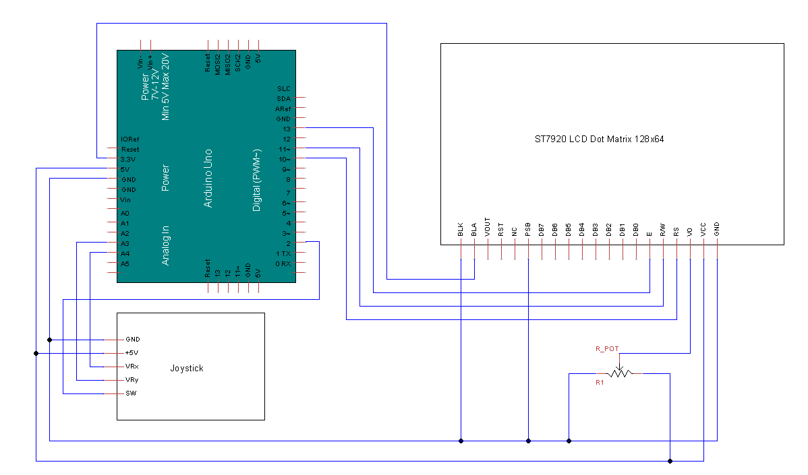

# ArduinoWeatherDisplay

An Arduino sketch for a weather forecast display device, targeting Uno WiFi 4.

On start the device will connect to the wifi network specified in the secrets.h file in the `src` folder:
```
#define SECRET_SSID "network_name"
#define SECRET_PASS "password"
```

After fetching weather from from https://open-meteo.com/ the weather forcast will be displayed in a grid of screens that can be navigated through with the joystick. The x axis will change the date and the y axis will change the location.
Press the joystick (z-axis) to load the weather at the present time in the selected location, which will be displayed for 5 seconds.

Modify the loaded locations using the `locNames`, `locLats` and `locLongs` arrays. Changing the number of locations will require a chnage to `MAX_LOCATIONS`.

The sketch was developed with PlatformIO. Building with PlatoformIO will allow dependancies to automatically be downloaded.

To run, the arduino should be wired as shown:
